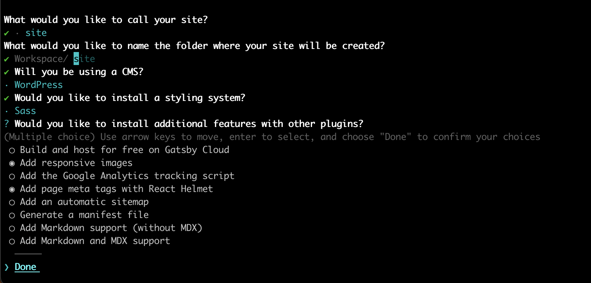

# JAM Stack | Creando sitios con Gatsby.js

## Capítulo 1: La noche oscura
Neo es consciente de un nuevo mundo cuando aparece lo siguiente en su pantalla: ```Knock, knock... Despierta Neo. 
Matrix te tiene. Sigue al conejo blanco.``` Neo sigue al conejo, tatuado en el hombro de una chica que acompaña a un grupo 
que lo visita y así encuentra a Trinity, quien le acerca a la verdad.

### Preparación

* Necesitaremos haber comprobado las herramientas necesarias en la fase anterior.

### Objetivo

familiarizarnos con los comandos básicos de gatsby y crear un site con su asistente.

### Ejercicio

1) Crear nuestro primer site en gatsby.js

Para ello, en este mismo repositorio, lanzaremos el comando ```gatsby new```
En el asistente indicaremos las siguientes opciones:



2) Generar un fichero index.js

Una vez hallamos lanzado por primera vez el site con ```gatsby serve``` o ```npm run start```

```bash
    $> cp .cache/default-html.js src/html.js
```

[tutorial](https://www.gatsbyjs.com/docs/custom-html/)

### Comprobación

```bash
    
    # Probamos nuestro site en desarrollo: 
    $> gatsby serve                 # Abrimos http://localhost:8000 y http://localhost:8000/___graphql
    
    # Construimos nuestro site
    $> gatsby deploy 
    $> cd public
    $> hs                           # Y comprobamos las url: http://localhost:8080

```
